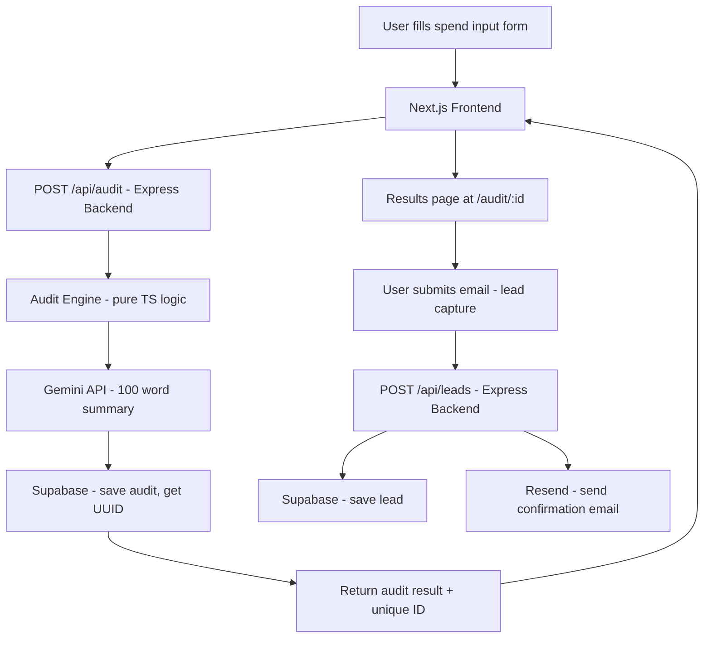

## System Diagram

## Data Flow

1. User fills the spend input form on the frontend with their 
   AI tools, plans, seat counts, team size, and use case.
2. Frontend sends a POST request to /api/audit on the Express backend.
3. The audit engine runs as a pure TypeScript function — no API calls, 
   no DB access. It evaluates each tool against pricing rules and 
   returns recommendations and savings numbers.
4. The backend calls the Gemini API with the audit result to generate 
   a personalized 100-word summary. If this fails, a templated 
   fallback is used.
5. The full audit result is saved to Supabase. A UUID is returned.
6. The frontend redirects to /audit/:id where the results are displayed.
7. If the user submits their email, a POST to /api/leads saves the 
   lead and triggers a Resend confirmation email.
8. The /audit/:id URL is the shareable link — identifying details 
   are not stored in the public audit record.

## Why This Stack

Next.js handles routing and SSR cleanly — the /audit/[id] dynamic 
route with server-side Open Graph meta tags was the main reason. 
Express backend kept the audit engine isolated and independently 
testable without any Next.js runtime. Supabase was chosen over 
Firebase for proper relational structure (audit → lead foreign key) 
and because Postgres is more familiar. Gemini free tier eliminated 
any cost barrier during development.

## What I'd Change for 10k Audits/Day

- Add a Redis job queue (BullMQ) so audit processing is async — 
  the Gemini API call currently blocks the response
- Cache Gemini responses for identical tool inputs — same stack 
  same summary, no need to call the API twice  
- Move audit result pages to static generation with ISR so 
  Supabase isn't hit on every shareable URL view
- Add read replicas on Supabase for the GET /audit/:id endpoint
- Rate limiting currently in-memory — would move to Redis-backed 
  rate limiting so it works across multiple backend instances